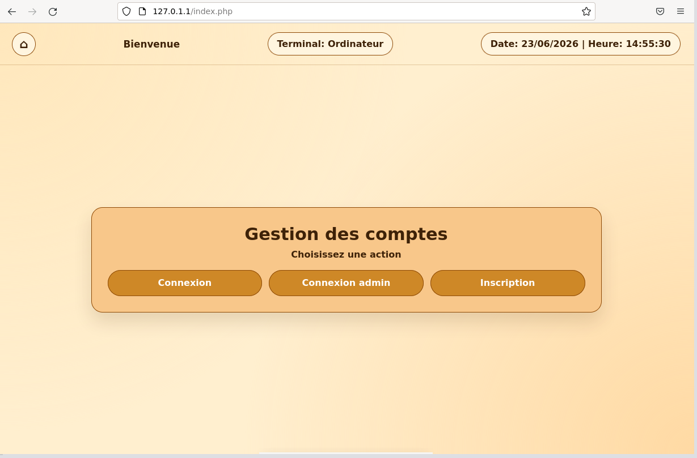
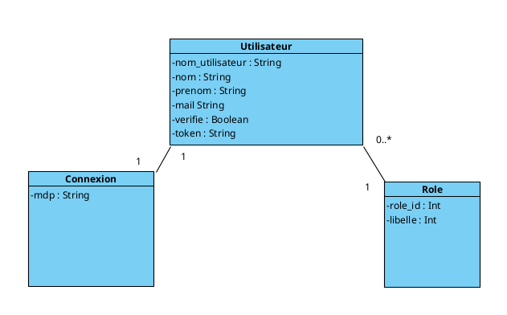
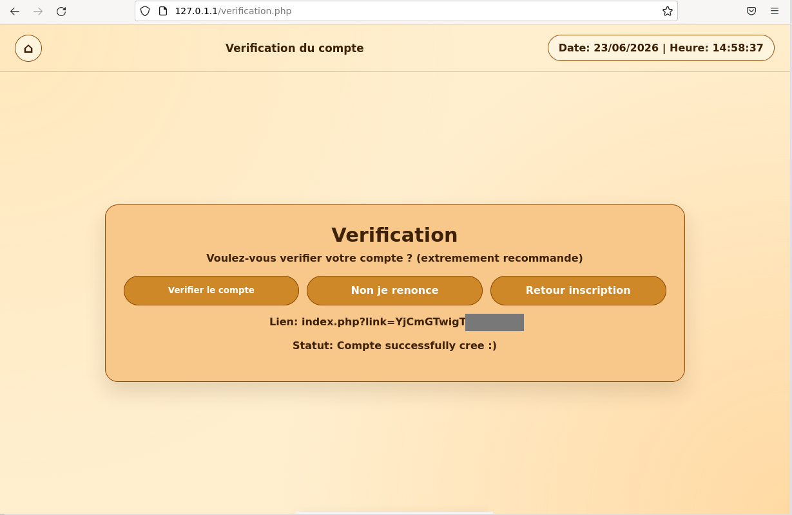
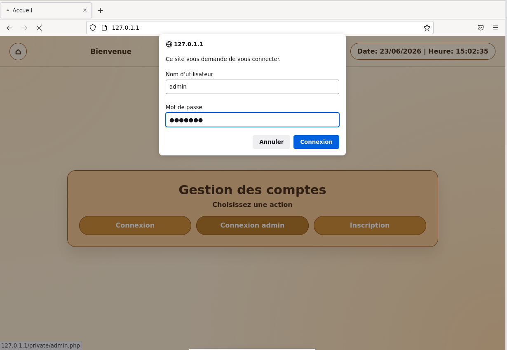
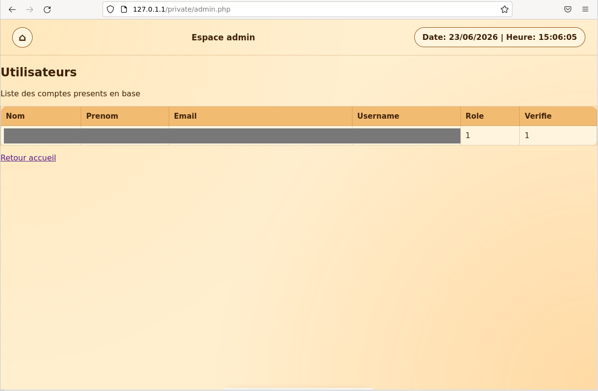

# Gestion de comptes : Apache2 / PHP / MySQL

Site web de gestion de comptes utilisateurs (inscription, vérification, connexion, espace administrateur), développé et déployé sous **Apache2** sur une machine virtuelle Debian.

> Projet universitaire en **BUT1 Informatique** (IUT de Lannion, 2026), réalisé en équipe de 4.
> Le code tournait sur les VM de l'IUT et n'a pas été conservé : ce dépôt présente le projet, son architecture et ses résultats.



## Fonctionnalités

- **Inscription** avec contrôle des champs vides et des doublons (nom d'utilisateur, e-mail)
- **Vérification de compte** par lien contenant un token aléatoire de 10 caractères, stocké en base
- **Connexion** utilisateur, puis page affichant les informations du compte
- **Espace administrateur** protégé par Apache (`htpasswd`), listant tous les comptes de la base
- **Page d'accueil dynamique** : date, heure et type de terminal (ordinateur, mobile, tablette)

## Stack

| Rôle | Technologies |
|---|---|
| Serveur | Apache2 2.4 sur Debian (VM) |
| Back-end | PHP 7.4 (`mysqli`) |
| Base de données | MySQL 8.0 |
| Front | HTML / CSS |
| Outils | Git, GitHub, diagramme de Gantt, script bash de déploiement |

## Architecture

La base `comptes` a été conçue à partir d'un diagramme de classes, puis traduite en SQL.



```sql
create table Role (
    role_id int primary key,
    libelle varchar(100)
);

create table Utilisateur (
    nom varchar(100),
    prenom varchar(100),
    mail varchar(100),
    nom_utilisateur varchar(30) primary key,
    role_id int,
    verifie boolean,
    token_verif varchar(100),
    foreign key (role_id) references Role(role_id)
);

create table Connexion (
    nom_utilisateur varchar(30) primary key,
    mdp varchar(50),
    foreign key (nom_utilisateur) references Utilisateur(nom_utilisateur)
);
```

**Parcours d'un utilisateur**

1. Formulaire d'inscription, envoyé en `POST` à `verification.php`
2. Création du compte et génération du token, enregistré dans `Utilisateur`
3. Clic sur le lien de vérification : le token et le nom d'utilisateur sont comparés à la base, puis `verifie` passe à `1`
4. Connexion, puis affichage des informations du compte



## Côté serveur (Apache)

- Configuration d'Apache et activation, désactivation et test du module PHP (`a2enmod`, `a2dismod`, `mods-enabled`)
- Diagnostic d'erreurs serveur : variables d'environnement Apache non définies, extension `php7.4-mysql` manquante installée à la main avec `dpkg`
- Dossier `/private` protégé par authentification Apache : fichier de mots de passe créé avec `htpasswd`, directive `AuthUserFile` dans un bloc `<Directory>`
- Script bash pour copier les fichiers du dossier de travail vers `/var/www/html`





*Les données personnelles des captures sont masquées.*

## Ma contribution

- Espace administrateur : protection par Apache et page listant les comptes
- Page d'affichage des informations du compte connecté
- Participation au suivi du projet (Gantt) et à la rédaction du rapport en équipe

## Limites et pistes d'amélioration

C'est un projet pédagogique de première année. Avec le recul, voici ce que je corrigerais en priorité :

| Problème | Correction |
|---|---|
| Mots de passe stockés en clair dans `Connexion` | Hachage avec `password_hash()` / `password_verify()` |
| Requêtes SQL construites par concaténation (risque d'injection SQL) | Requêtes préparées (`mysqli_prepare` ou PDO) |
| Pas de session : la page « connecté » dépend d'un paramètre dans l'URL | Sessions PHP (`$_SESSION`) et vérification côté serveur |
| L'application se connecte à MySQL avec le compte `root` | Utilisateur dédié avec droits limités |
| Lien de vérification affiché à l'écran | Envoi du lien par e-mail |
| Admin géré par Apache, séparé des rôles de la base | Gestion des rôles unifiée en base |

## Ce que j'en ai retenu

Comprendre comment une requête traverse un serveur web, le langage côté serveur et la base de données. Diagnostiquer une panne en lisant les logs. Travailler à plusieurs avec Git. Et surtout, repérer les failles de sécurité de mon propre code.
